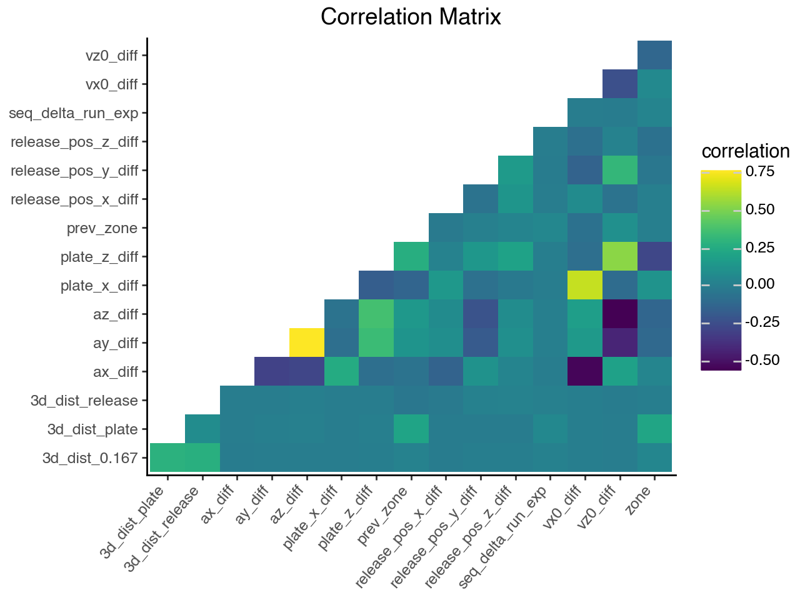

# Feature Selection

Selecting only the most important features to go into the Sequence+ model, would make it simpler. Just to explore the features I created, I made a correlation matrix and a relationship matrix with the `delta_run_exp` variable (our target variable).

This is not super promising, as there are virtually zero features that have any apparent correlation with `delta_run_exp`. However I think that some combination of these features could still explain variance. This means that a more complex 'black box' model would probably the approach. While it won't be the simplest or most explainable model at first, I think it would certainly achieve the best results.

I found [this article on embedding feature selection]() which outlines an approach to dynamic feature selection embedded as an [attention]() layer into an LSTM model. This is probably as good as this will get in terms of feature selection. 
