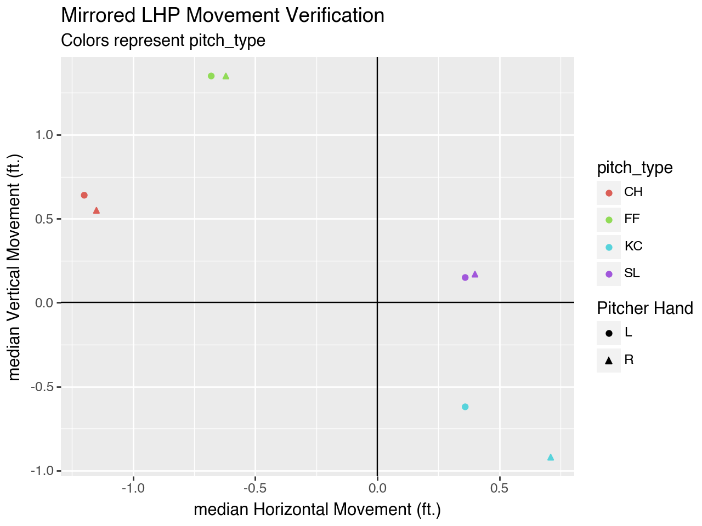

# Tunnel+

Earlier this year I created [Tunnel Score]() to try and quantify how well any given two pitch sequence was tunneled. Overall it doesn't do a bad job, but it is hard to capture how 'good' a pitch was truly tunneled with just this one number. 

In addition Tunnel Score only considers the difference between 2D locations of the ball when they cross the plate, and where they would have crossed the plate without induced movement. This could be improved by considering the 3D distance between pitches in a two pitch sequence at [decision time]() (~0.12 seconds) and [commit time]() (~0.167 seconds) into the balls flight path. 

## Approach

Tunnel+, like [Stuff+](), [Location+](), and [Pitcher+](), will be a machine learning model built to predict the run value of a pitch. The difference will be that of course Tunnel+ will incorporate pitch tunneling related features.

## Feature Engineering

| Feature Name | Description |
|------|-------------|
| **delta_run_exp** | run value associated with the pitch outcome from `run_values_24`| 
| **x_0.120** | position in the x dimension of the pitch at decision time (~0.12s) |
| **y_0.120** | position in the y dimension of the pitch at decision time (~0.12s) |
| **z_0.120** | position in the z dimension of the pitch at decision time (~0.12s) |
| **x_0.167** | position in the x dimension of the pitch at commit time (~0.167s) |
| **y_0.167** | position in the y dimension of the pitch at commit time (~0.167s) |
| **z_0.167** | position in the z dimension of the pitch at commit time (~0.167s) |
| **velocity_diff** | difference in velocity between pitches in a two pitch sequence |
| **effective_velocity_diff** | difference in effective velocity between pitches in a two pitch sequence |
| **pfx_x_diff** | difference in horizontal movement between pitches in a two pitch sequence |
| **pfx_z_diff** | difference in vertical movement between pitches in a two pitch sequence |
| **3d_dist_0.167** | 3D euclidean distance between pitches in a two pitch sequence 0.167 seconds after release |
| **3d_dist_0.120** | 3D distance between pitches in a two pitch sequence at 0.120 seconds after release |
| **distance** | 2D euclidean distance between pitch locations when crossing the plate in a two pitch sequence |
| **seq_delta_run_exp** | sum of `delta_run_exp` in a two pitch sequence |
| **plate_x_diff** | difference in plate_x between pitches in a two pitch sequence |
| **plate_z_diff** | difference in plate_z between pitches in a two pitch sequence |

In order to not confuse the model with the difference between LHP and RHP position metrics, I mirrored LHP movement & release position metrics to reflect RHP

    

### 3d pitch displacement calculation

Plugging in our pitch data into the kinematic equation for displacement below, I can solve for where the ball is at a given time $t$

$d = pos_{i} + v_{i} * t + \frac{1}{2} * a * t^{2}$

**where**:
- $t$ = time (seconds)
- $v_{i}$ = velocity at time $t$ in dimension $i$
- $a_{i}$ = acceleration at time $t$ in dimension $i$
- $pos_{i}$ = start position in dimension $i$

statcast (*almost*) gives us this data in the form of ...

- `vx0`: velocity of ball in x dimension at 50ft.
- `vy0`: velocity of ball in y dimension at 50ft.
- `vz0`: velocity of ball in z dimension at 50ft.
- `ax`: acceleration of ball in x dimension at 50ft.
- `ay`: acceleration of ball in y dimension at 50ft.
- `az`: acceleration of ball in z dimension at 50ft.
- `release_pos_x`: x position at release
- `release_pos_y`: y position at release
- `release_pos_z`: z position at release

For this project, as of now I am just assuming these numbers to be constant throughout ball flight even though they are not. Should be good enough.

## Feature Selection

## Model
