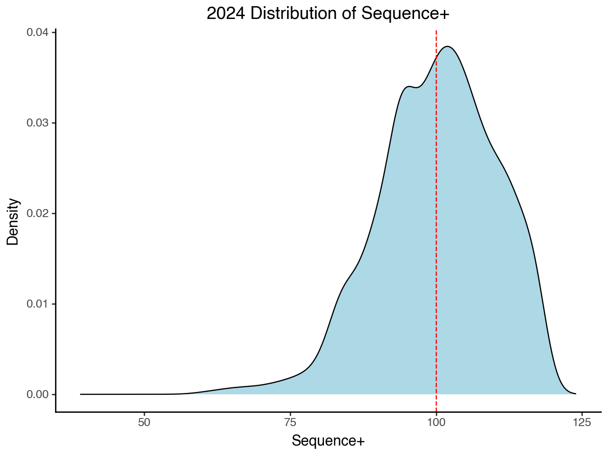

# Sequence+

The main goal of Sequence+ is to create a model like [Stuff+](https://www.google.com/search?client=safari&rls=en&q=stuff%2B&ie=UTF-8&oe=UTF-8), [Location+](https://www.google.com/search?client=safari&rls=en&q=stuff%2B&ie=UTF-8&oe=UTF-8), and [Pitcher+](https://www.google.com/search?client=safari&rls=en&q=stuff%2B&ie=UTF-8&oe=UTF-8) that aims to predict the expected run value based on any two pitch sequence. 

# General Approach

I have a run expectancy matrix for 2024, that describes roughly how many runs each event in each possible situation is worth. These values are averaged out for each count, which will help isolate this run expectancy value from baserunning situations. Using this and pitch by pitch advanced data from 2020-2023, I am aiming to build a model that can predict the cumulative run expectancy for a given sequence of two pitches. This target variable is refered to as `seq_delta_run_exp` thoughout the documentation and code. 

## Features

In order to try and include pitch tunneling in this model, I use the kinematic equations to estimate the location of the baseball in 3D space at the commit point, decision point, release, and over the plate.

See [3D_pitch_location_estimation.md](./docs/3D_pitch_location_estimation.md) or the feature engineering section of [sequence+.ipynb](./notebooks/sequence+.ipynb) for details on how I am doing this.

Some more features related to pitch sequences and pitch quality were added that would hopefully help explain variance in `seq_delta_run_exp`. The chart below shows the features that are currently selected, and their importances.

## Model

The model architecture that I ended up using is a LightGBM Regressor model with a RobustScaler. The RobustScaler() improves performance because it handles outliers better than StandardScaler().  

I used [optuna](https://optuna.org) to tune hyperparameters to fit a slightly better model that I would guessing them on my own. 

## Evaluation

Based on this chart, Sequence+ appears to have solid negative correlations with FIP & WHIP, and a strong positive correlation with K/BB. All this while having no correlation with Stuff+ (which is a good thing). It does appear similar to Location+ and Pitching+, which is somewhat expected because the features used to train them are likley somewhat correlated with the features used to train Sequence+.

Pitchers are not always trying to tunnel their pitches, explaining the silght bimodal bump below average in the distribution of Sequence+ in 2024 shown below. 

That being said, with the current model, Sonny Gray's Sweeper-Four Seam and George Kirby's Slider-Four Seam combo score the highest in average Sequence+ with 106 and 105 respectivley. 

1. 🎥 Sonny Gray Clip Sequence+: 115
2. 🎥 George Kirby Clip Sequence+: 117

This is still a work in progress because it seems that Sequence+ could be more isolated from Location+. When taking a look at some of the top sequences by average Sequence+, there are some pitch combinations that are two of the same pitch back to back. This is an issue because how could two of the same pitch be tunneled well? I took a look at some video footage of sequences that recieved a high Sequence+, but where the same pitch back to back and from what I can tell all of these pitches were painted on the edge of the strike zone. Long story short, there is still work to be done in isolating pitch tunneling from location.

# Road Map

- [x] Feature Engineering
- [x] Model Building
- [ ] Evaluation
- [ ] Article
- [ ] Dashboard

# References

- [statcast-era-pitches](https://huggingface.co/datasets/Jensen-holm/statcast-era-pitches): Used this huggingface dataset to effeciently load dataset of pitches thrown from 2017-present.
- [Carter Kessinger](https://x.com/ckessinger44) & [Johnny Davis](https://x.com/Johnny_Davis12): These guys sparked the idea for using kinematic equations for 3D distances at commit & decision points for a better [TunnelScore]().
- [TJ Nestico](https://x.com/TJStats): He posts lots of great content on X, and I am using a pitch by pitch run expectancy matrix found in his project [tjStuff+](https://github.com/tnestico/tjstuff_plus)

# Contact

Feel free to reach out to me with any questions or feedback 

Email: jensenh87@gmail.com  
X: [@\_holmj\_](https://x.com/_holmj_)
